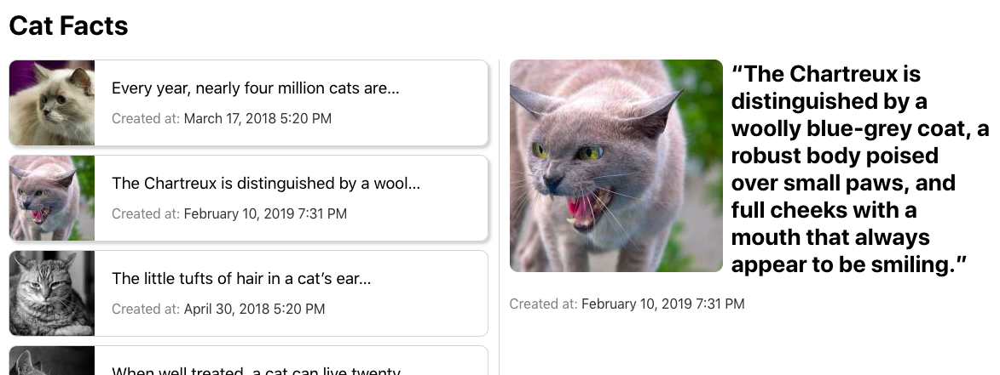

This project is a simple Cat Facts List made with React, part of an application to a frontend position at [XING](https://www.xing.com/).

# Installing

    npm install

# Running

    npm start

# Comments / Limitations / Trade-offs

- Layout is quite crude because of time constraint + not using a CSS framework for full compatibility. Only tested on Chrome. Not good on mobile portrait for instance.
- Didn't write any tests as I didn't find the time and didn't use a test-first approach. It is not my strength so I think I could do it but would take more time than what was available.
- On the other hand, added JSDoc as I think it is very useful and doesn't take too much time. Also it is shown on the IDE (I use VSCode) so it already shows what props every component expect, which is super handy.
- Regarding external libs choices:
  - used Sass because its sub-selector is very convenient and typically some CSS processor is used.
  - used [Moment.js](https://momentjs.com/) because there would be unnecessary to reinvent the wheel to display creation time nicely.
  - did the API call with fetch, no need to add an external lib like axios only for a GET request; on the other hand fetch API is much nicer than standard XHR.
  - not exactly a "lib", but used [Lorem Pixel](http://lorempixel.com) to get cats photos, as they were not provided by API.
- Had to use the [cors-anywhere trick](https://cors-anywhere.herokuapp.com/) (an external server to add CORS headers) because I didn't notice that the [API I chose](https://cat-fact.herokuapp.com) didn't had it, and it would cost too much time to find another API and change everything to match it.
- If I had more time (or more practically, if it had been a bigger project, because on such a small project it wouldn't make much sense) I would add Redux, work on tests and make a better layout specially for mobile.
